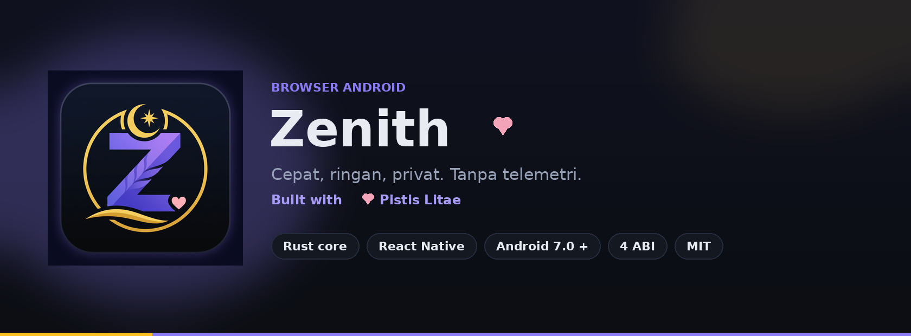
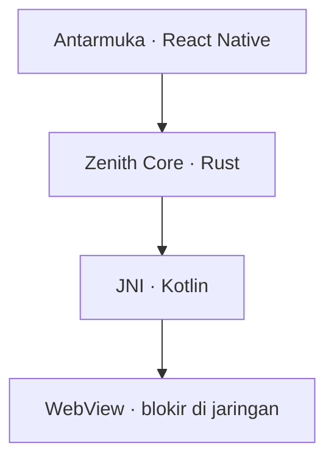

<p align="center">
  
</p>

<p align="center">
  <a href="https://github.com/ahyat786/Zenith-App/releases/latest/download/Zenith-android.apk">
    
  </a>
  &nbsp;&nbsp;
  <a href="https://github.com/ahyat786/Zenith-App/releases/latest">
    
  </a>
</p>

<p align="center">
  <a href="https://github.com/ahyat786/Zenith-App/releases/latest"></a>
  
  <a href="https://github.com/ahyat786/Zenith-App/actions/workflows/android.yml"></a>
  <a href="./LICENSE"></a>
</p>

<p align="center">
  <strong>Browser Android yang tenang.</strong> Omnibox mengambang, perisai di samping alamat, inti Rust.<br />
  Tanpa telemetri. Tanpa iklan. Semua data tetap di perangkat.<br />
  <sub>Tombol unduh mengambil berkas langsung — bukan halaman rilis. Selalu rilis terbaru.</sub>
</p>

---

## Unduh

Tombol di atas mengarah ke:

**[Unduh APK rilis terbaru](https://github.com/ahyat786/Zenith-App/releases/latest/download/Zenith-android.apk)**

GitHub mengalihkan tautan itu ke aset `Zenith-android.apk` pada [rilis terbaru](https://github.com/ahyat786/Zenith-App/releases/latest). Setiap tag juga menyimpan salinan berversi, `Zenith-vX.Y.Z-android.apk`, bila Anda perlu berkas yang tidak berubah.

| | |
| --- | --- |
| Paket | `com.zenith.browser` |
| Kompatibilitas | Android 7.0 (API 24) → Android 16/17 |
| ABI | arm64-v8a, armeabi-v7a, x86, x86_64 — satu APK |
| Mesin | Hermes + `libzenith_core.so` |
| Tanda tangan | Kunci rilis, diperiksa `apksigner` di GitHub Actions |

**Pasang**

1. Unduh APK.
2. Buka berkas dan izinkan pemasangan dari sumber ini.
3. Selesai. Tidak ada akun.

Lewat ADB: `adb install -r Zenith-android.apk`

Nama `Zenith-android.apk` adalah kontrak tombol unduh. Workflow rilis menyalin APK ke nama itu pada setiap tag. Jangan diubah.

---

## Antarmuka

<p align="center">
  
</p>

Angka pada skema di atas adalah keputusan, bukan hiasan. Enam hal itu tidak pindah tempat.

| | Sentuh | Yang terjadi |
| --- | --- | --- |
| **＋** | Sekali | Omnibox terbuka di atas tab saat ini. Tidak ada halaman tab-baru. |
| **Pil alamat** | Sekali | Cari, sunting URL, atau loncat ke tab, bookmark, dan riwayat. |
| **Perisai** | Sekali | Shield Guard untuk situs ini: blokir, JavaScript, HTTPS, desktop, log hostname. |
| **Tautan** | Tekan lama | Tab baru, tab privat, Glance, atau bagikan. Glance tidak masuk riwayat. |
| **Kartu tab** | Tekan lama | Split, masuk grup, atau pindah workspace. |
| **Monitor** | Sekali | Mode desktop untuk host ini saja. Pil alamat menandai `DESKTOP`. |
| **Bintang** | Sekali | Bookmark halaman ini. |
| **Kompak** | Dari menu | Semua bar disembunyikan. Konten memakai seluruh layar. |

Bar alat, dari kiri: kembali, maju, muat ulang (berubah menjadi berhenti saat memuat), tab baru, jumlah tab, desktop, menu. Menu membawa pengaturan, skrip, ekstensi, dan unduhan — bukan ke dalam omnibox.

---

## Yang ada di tangan

<table>
  <tr>
    <td width="33%" align="center" valign="top">
      <br />
      <strong>Ruang yang tenang</strong><br />
      <sub>Workspace, mode kompak, split dua panel, dan Glance. Omnibox mengambang — layar tidak dibuka dengan halaman kosong.</sub>
    </td>
    <td width="33%" align="center" valign="top">
      <br />
      <strong>Shield Guard</strong><br />
      <sub>Blokir iklan di level jaringan, penghitung di perisai, log hostname, upgrade HTTPS, serta DNS utama dan cadangan.</sub>
    </td>
    <td width="33%" align="center" valign="top">
      <br />
      <strong>Skrip dan ekstensi</strong><br />
      <sub>Userscript format Greasy Fork. Subset ekstensi Chrome lewat content script. Batasnya ditulis di bawah, bukan disembunyikan.</sub>
    </td>
  </tr>
  <tr>
    <td width="33%" align="center" valign="top">
      <br />
      <strong>Unduhan yang selesai</strong><br />
      <sub>Empat koneksi paralel, progres dan kecepatan di layar Unduhan, lalu buka atau bagikan. Bisa jatuh ke unduhan sistem.</sub>
    </td>
    <td width="33%" align="center" valign="top">
      <br />
      <strong>Tetap di perangkat</strong><br />
      <sub>Tanpa telemetri. Riwayat, bookmark, skrip, ekstensi, dan pengaturan tidak dikirim ke mana pun.</sub>
    </td>
    <td width="33%" align="center" valign="top">
      <br />
      <strong>Satu APK, empat ABI</strong><br />
      <sub>Android 7.0 sampai 16/17. Inti Rust, antarmuka React Native, mesin Hermes. Bila `.so` tidak ada, pola jatuh ke TypeScript.</sub>
    </td>
  </tr>
</table>

### Shield Guard

Perisai duduk di kiri alamat karena itulah yang paling sering dibutuhkan, bukan di dalam pengaturan.

- Blokir iklan dan pelacak di `shouldInterceptRequest`, bukan sekadar CSS.
- Angka pada perisai adalah permintaan yang diblokir di sesi ini.
- Log koneksi menampilkan hostname beserta statusnya: halaman, lolos, atau diblokir.
- JavaScript, upgrade HTTPS, dan mode desktop bisa diubah per situs.
- Daftar blokir bawaan, plus impor hosts (StevenBlack, AdAway) atau format Pi-hole.
- DNS Aman: kelompok server utama dan cadangan, uji resolusi, dan panduan DNS Privat Android. Menerapkan DNS ke seluruh koneksi tetap lewat pengaturan sistem — bukan VPN di dalam browser.

### Skrip dan ekstensi

- Metadata userscript (`@name`, `@match`, `@include`, `@exclude`, `@run-at`, `@grant`) diurai di Rust.
- Shim `GM_addStyle`, `GM_getValue`, `GM_setValue`, `GM_listValues`, `unsafeWindow`.
- Ekstensi: impor ZIP berisi `manifest.json` (MV2/MV3). `content_scripts` disuntik sesuai `matches` dan `run_at`.
- Shim kecil untuk `chrome.storage.local` dan `chrome.runtime.sendMessage`.
- Service worker, `webRequest`, dan `declarativeNetRequest` tidak dijalankan. Itu batas WebView, bukan daftar tunggu yang disamarkan.

### Lainnya, singkat

Mesin pencari kustom dengan `%s` dan URL saran. Google, DuckDuckGo, Bing, Wikipedia, dan Brave Search tersedia dari awal. Riwayat 500 entri. Sesi dipulihkan. Tema gelap, terang, atau ikut sistem. Bar bisa di bawah atau di atas.

---

## Arsitektur



Tiga lapis, satu arah.

| Lapis | Isi |
| --- | --- |
| TypeScript | Browser, omnibox, tab, workspace, Glance, pengaturan |
| Rust | Pola URL, userscript, manifest ekstensi, adblock, normalisasi `%s` |
| Kotlin | Jembatan JNI, `shouldInterceptRequest`, unduhan multi-thread |

Injeksi skrip tidak berpacu dengan halaman. Jembatan statis masuk di `document-start`, lalu mengirim `zen:docstart`, `zen:docend`, dan `zen:docidle`. Setiap sinyal dicocokkan di Rust, lalu payload disuntik sekali. Untuk SPA ada `zen:urlchange`.

---

## Bangun sendiri

Node 22, JDK 17, Android SDK (platform 37, build-tools 37), NDK `27.1.12297006`, Rust stable, dan `cargo-ndk`.

```bash
rustup target add aarch64-linux-android armv7-linux-androideabi \
  x86_64-linux-android i686-linux-android
cargo install cargo-ndk

npm install
cd android && ./gradlew assembleRelease
```

APK ada di `android/app/build/outputs/apk/release/`. Tanpa variabel kunci rilis, Gradle memakai kunci debug. Itu untuk pengembangan, bukan berkas yang tombol unduh berikan.

Lewati kompilasi Rust bila `.so` sudah ada: `./gradlew assembleRelease -Pzenith.skipRust=1`. Uji inti saja: `cd rust && cargo test`.

APK lebih kecil, sekitar 30 MB, dengan membatasi ABI di `android/gradle.properties`:

```
reactNativeArchitectures=arm64-v8a,armeabi-v7a
```

GitHub Actions (`.github/workflows/android.yml`) membangun APK pada push ke `main`, tag `v*`, dan `workflow_dispatch`. Rilis GitHub dibuat hanya dari tag.

---

## Tanda tangan

Tidak ada kunci, token, atau kata sandi di repositori ini.

| Secret | Isi |
| --- | --- |
| `ZENITH_KEYSTORE_BASE64` | Keystore PKCS12, RSA-4096, disimpan sebagai base64 |
| `ZENITH_KEYSTORE_PASSWORD` | Kata sandi keystore |
| `ZENITH_KEYSTORE_ALIAS` | Alias, `zenith` |
| `ZENITH_KEY_PASSWORD` | Kata sandi kunci |

CI men-decode secret ke berkas sementara, Gradle menandatangani lewat env `ZENITH_KEYSTORE_*`, lalu `apksigner verify` mencetak sertifikat di log. Secret GitHub tidak bisa dibaca ulang. Simpan keystore di pengelola kata sandi. Rotasi: `scripts/generate-release-keystore.sh`, lalu perbarui keempat secret.

Jangan menaruh token akses di kode, README, atau perintah git yang ter-commit. Bila token sempat tertulis di chat atau log, cabut di GitHub → Settings → Developer settings.

---

## Batasan

| Batas | Artinya |
| --- | --- |
| Mesin render adalah WebView | Kecepatan dan standar web mengikuti System WebView di perangkat. Sama seperti Via. |
| Ekstensi = content script | Background, service worker, dan `webRequest` tidak berjalan. Kiwi, yang merupakan fork Chromium, bisa. Zenith tidak. |
| Tab privat | Pada Android di bawah API 28, cookie tetap di profil WebView bersama. Yang privat: tidak dicatat ke riwayat, saran, atau penyimpanan aplikasi. |
| `document-start` | Best-effort, beberapa milidetik setelah sinyal jembatan — bukan sebelum skrip pertama halaman. |
| Pola URL | `*://`, `http(s)`, `*.host`, glob `*`, regex `/.../`. `file://` dan `.tld` tidak didukung. |
| DNS | Uji resolusi dan panduan DoT. Bukan VPN, dan tidak melewati pemblokiran DPI/SNI. |

---

## Kredit

Zenith berdiri di atas pekerjaan orang lain. Nama di bawah adalah atribusi, bukan klaim kepemilikan.

| | Dari | Yang diambil |
| --- | --- | --- |
| [Zen Browser](https://github.com/zen-browser/docs) | Dokumentasi UX | Workspace, mode kompak, split, Glance, omnibox mengambang, mesin pencari `%s` |
| [Via Browser](https://github.com/tuyafeng/Via) | Yafeng Tu | Userscript Greasy Fork, pengaturan per situs, sikap ringan dan tanpa iklan |
| [Kiwi Browser](https://github.com/kiwibrowser/src.next) | src.next | Model ekstensi Chrome: manifest MV2/MV3 dan content script |
| [Brave](https://github.com/brave/brave-browser) | Shields | Perisai per situs, penghitung blokir, upgrade HTTPS, Brave Search |

Kode Zenith berlisensi **MIT** — lihat [LICENSE](./LICENSE). Zenith adalah proyek independen. Bukan produk resmi Zen, Via, Kiwi, atau Brave.

**Built with 🩷 [Pistis Litae](https://github.com/ahyat786).**

---

## Peta jalan

- [ ] Sinkronisasi pengaturan, opsional, terenkripsi ujung ke ujung
- [ ] Panel log untuk `zen:error` saat menulis skrip
- [ ] `@require` untuk pustaka eksternal
- [ ] Isolasi profil WebView penuh untuk tab privat (API 28+)
- [ ] Folder bookmark, impor dan ekspor HTML
