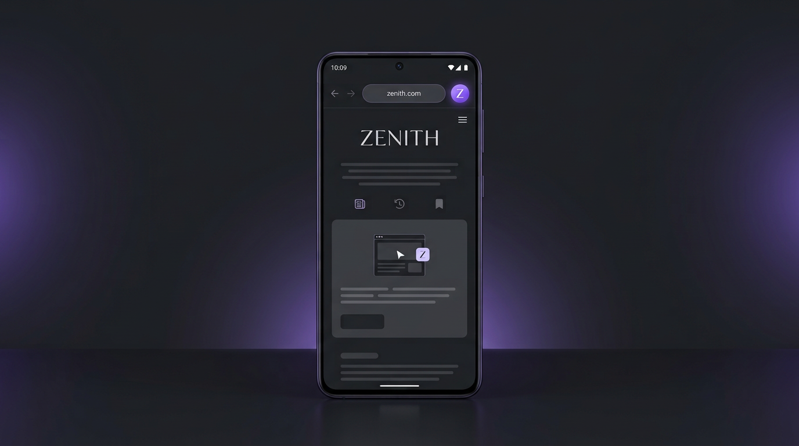
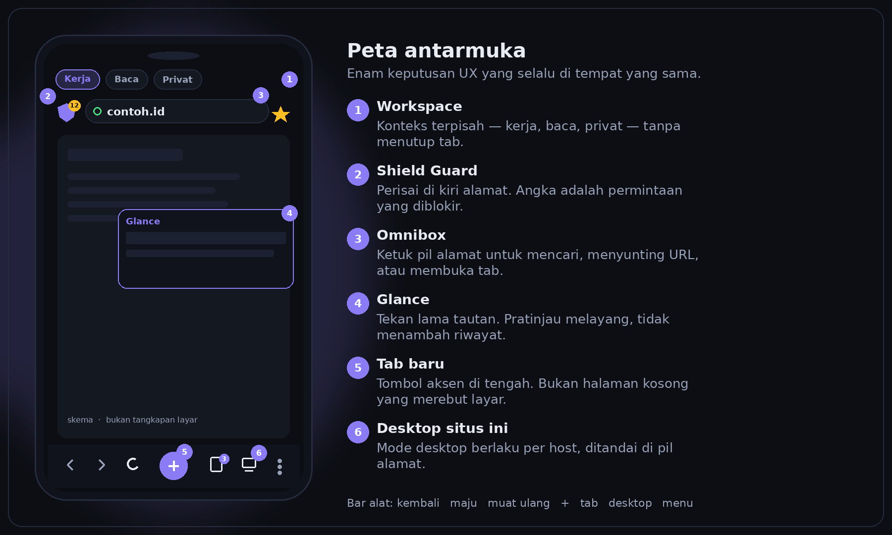
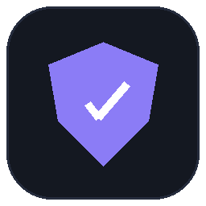
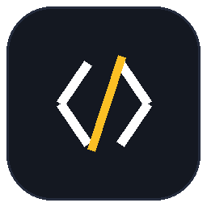
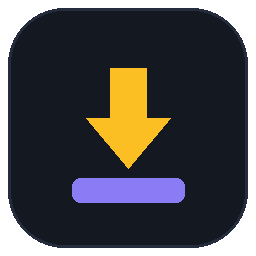

<p align="center">
  
</p>

<h1 align="center">Browser yang tenang.<br/>Kecepatan WebView.</h1>

<p align="center">
  Profil terpisah seperti di desktop. Tab yang terbuka tidak hilang saat Anda pindah.<br/>
  Perisai di samping alamat. Unduhan yang selesai. Tidak ada akun, tidak ada telemetri.
</p>

<p align="center">
  <a href="https://github.com/ahyat786/Zenith-App/releases/latest/download/Zenith-android.apk">
    
  </a>
  &nbsp;
  <a href="https://github.com/ahyat786/Zenith-App/releases/latest">
    
  </a>
</p>

<p align="center">
  <a href="https://github.com/ahyat786/Zenith-App/releases/latest"></a>
  
  <a href="https://github.com/ahyat786/Zenith-App/actions/workflows/android.yml"></a>
  <a href="./LICENSE"></a>
</p>

<p align="center">
  <sub>Tombol unduh mengambil berkas langsung — <code>Zenith-android.apk</code> pada rilis terbaru.</sub>
</p>

---

## Kenapa Zenith

<table>
  <tr>
    <td width="33%" valign="top">
      <h3>Profil, bukan akun</h3>
      <p>Kerja, sekolah, dan pribadi tidak berbagi kuki, riwayat, markah, skrip, atau tab. Tidak ada sinkronisasi ke server. Semuanya tinggal di perangkat.</p>
    </td>
    <td width="33%" valign="top">
      <h3>Tab tidak hilang</h3>
      <p>Pindah profil atau workspace tidak menutup tab. Sesi tetap tersimpan, dan halaman yang baru saja ditinggalkan tidak dipaksa memuat ulang dari nol.</p>
    </td>
    <td width="33%" valign="top">
      <h3>Cepat seperti WebView</h3>
      <p>Mesinnya Chromium System WebView — keluarga yang sama dengan Chrome. Zenith menambahkan cangkang browser, bukan salinan Chromium 100 MB yang lebih lambat dibuka.</p>
    </td>
  </tr>
</table>

## Yang Anda sentuh

| | |
| --- | --- |
| **Avatar profil** | Satu ketuk di kiri alamat. Pindah profil. Tab profil lain tetap ada. |
| **＋** | Tab baru penuh, bukan hanya kotak cari. Di profil privat, tab baru ikut privat. |
| **Pil alamat** | Cari, sunting URL, atau lompat ke tab, markah, dan riwayat profil ini. |
| **Perisai** | Blokir, JavaScript, HTTPS, desktop, dan log hostname untuk situs ini. |
| **Kembali** | Halaman sebelumnya tetap di memori. Tidak dimuat ulang hanya karena Anda keluar sebentar. |

<p align="center">
  
</p>

## Profil

Satu perangkat, beberapa kehidupan daring. Pola yang sama dengan profil Chrome, Firefox, dan Brave di desktop — tanpa login.

- **Utama** sudah ada. Tambah Kerja, Sekolah, atau nama apa pun.
- Tiap profil menyimpan tab, workspace, riwayat, markah, pencarian terakhir, skrip, ekstensi, dan pengaturan situs.
- Kuki dan penyimpanan halaman dipisah bila System WebView mendukung profil. Perangkat lama tetap memisahkan data aplikasi; laman tab baru mengatakan bila kuki belum bisa dipisah.
- Hapus profil hanya menghapus profil itu. Yang lain tidak ikut.

## Perisai, skrip, unduhan

<table>
  <tr>
    <td width="33%" align="center" valign="top">
      <br />
      <strong>Shield Guard</strong><br />
      <sub>Blokir di jaringan, bukan sekadar CSS. Penghitung di perisai. DNS utama dan cadangan.</sub>
    </td>
    <td width="33%" align="center" valign="top">
      <br />
      <strong>Skrip dan ekstensi</strong><br />
      <sub>Userscript Greasy Fork. Ekstensi Chrome lewat content script, per profil.</sub>
    </td>
    <td width="33%" align="center" valign="top">
      <br />
      <strong>Unduhan</strong><br />
      <sub>Berkas sungguhan, paling banyak 4 koneksi, dan tidak mengulang sendiri.</sub>
    </td>
  </tr>
</table>

## Mesin

Zenith adalah browser. Bukan halaman WebView yang dibungkus tombol.

Yang membuat sebuah aplikasi terasa seperti browser adalah sesi, profil, kembali yang instan, perisai, dan unduhan. Itu ada di sini. Mesin render-nya System WebView: Chromium yang sudah ada di Android, diperbarui oleh sistem, dan secepat WebView karena memang itu mesinnya. Membawa fork Chromium penuh akan membuat APK jauh lebih besar tanpa membuat halaman lebih cepat di kebanyakan perangkat.

Batasnya jujur: service worker ekstensi dan `webRequest` tidak berjalan. Content script berjalan.

## Panduan desain & rilis

- **v0.9.0** — posisi gulir per tab + audit type scale Material 3 (122 titik) → [RELEASE-v0.9.0.md](RELEASE-v0.9.0.md)
- **v0.8.0** — histori WebView per tab (`saveState`/`restoreState`), panel Shield Guard Material 3, perbaikan skala huruf → [RELEASE-v0.8.0.md](RELEASE-v0.8.0.md)
- **v0.7.0** — rekomendasi lanjutan §7 v0.6.0: keep-alive WebView, warna dinamis Material You, Snackbar "Urungkan", transisi emphasized, perbaikan skala huruf → [RELEASE-v0.7.0.md](RELEASE-v0.7.0.md)
- **v0.6.0** — pemeriksaan silang panduan resmi Android (Material 3, WebView, edge-to-edge, aksesibilitas)

### Catatan v0.6.0

Antarmuka dan perilaku aplikasi mengikuti panduan resmi Android Developers:

- **Material 3** — warna berbasis peran (permukaan bertingkat, primary/on-primary), *type scale*, bentuk 12/16/28, elevation, dan ripple sebagai state layer.
- **Edge-to-edge** — status/navigation bar transparan dengan warna ikon mengikuti tema; inset keyboard dibaca dari `WindowInsets` karena `adjustResize` tidak lagi bekerja sejak Android 15.
- **Aksesibilitas** — target sentuh ≥ 48dp di semua tombol, label untuk TalkBack, dan status "terpilih/nonaktif" yang diumumkan.
- **Tata letak adaptif** — pintasan 4/6/8 kolom dan kartu tab 2/3/4 kolom sesuai kelas ukuran jendela (ponsel, lipat, tablet).
- **Layar utama Android** — splash screen Android 12+ dan ikon adaptif dengan lapisan monokrom (ikon bertema Material You).
- **WebView** — Jetpack Webkit untuk mode gelap algoritmik dan Safe Browsing, pengelolaan pop-up, histori, dan kebersihan memori.

Pemeriksaan silang lengkap terhadap lima halaman resmi Android beserta daftar deviasi yang disengaja ada di
[`DESIGN-v0.6.0.md`](./DESIGN-v0.6.0.md); audit bug ada di [`AUDIT-v0.5.2.md`](./AUDIT-v0.5.2.md).

## Pasang

| | |
| --- | --- |
| Paket | `com.zenith.browser` |
| Android | 7.0 (API 24) sampai 16/17 |
| ABI | arm64-v8a, armeabi-v7a, x86, x86_64 |
| Tanda tangan | Kunci rilis, diperiksa di GitHub Actions |

1. [Unduh APK](https://github.com/ahyat786/Zenith-App/releases/latest/download/Zenith-android.apk).
2. Buka berkas dan izinkan pemasangan dari sumber ini.
3. Pilih profil. Selesai.

`adb install -r Zenith-android.apk`

Nama `Zenith-android.apk` adalah kontrak tombol unduh. Jangan diubah.

## Bangun

Node 22, JDK 17, Android SDK platform 37, build-tools 37, NDK `27.1.12297006`, Rust stable, `cargo-ndk`.

```bash
npm install
cd android && ./gradlew assembleRelease
```

GitHub Actions membangun APK pada push ke `main` dan pada tag `v*`. Rilis GitHub dibuat dari tag. Secret penanda tangan tidak ada di repositori.

## Kredit

Zenith berdiri di atas pekerjaan orang lain. Bukan produk resmi mereka.

| | |
| --- | --- |
| [Zen Browser](https://github.com/zen-browser/docs) | Workspace, split, Glance, omnibox |
| [Via](https://github.com/tuyafeng/Via) | Sikap ringan, userscript, pengaturan per situs |
| [Kiwi](https://github.com/kiwibrowser/src.next) | Model content script |
| [Brave](https://github.com/brave/brave-browser) | Perisai per situs |
| [Firefox](https://www.mozilla.org/firefox/) dan [Chrome](https://www.google.com/chrome/) | Pola profil dan halaman unduh |

Kode berlisensi **MIT**. **Built with 🩷 [Pistis Litae](https://github.com/ahyat786).**
